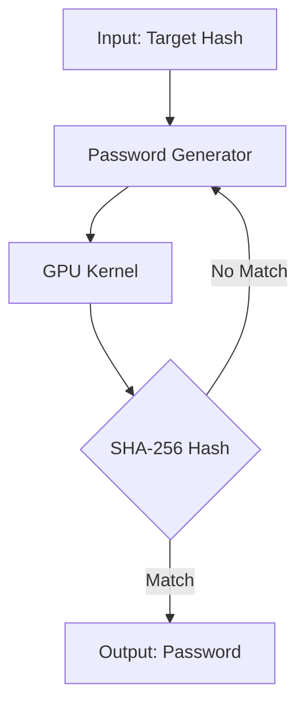
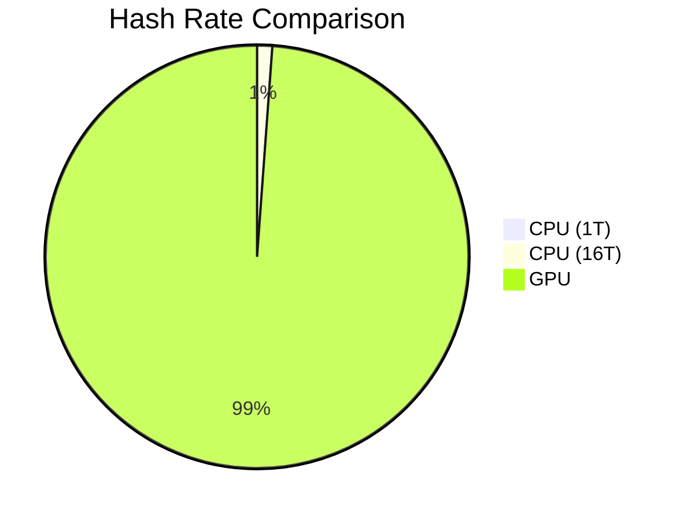

# 🚀 SHA-256 Password Cracker
### High-Performance GPU-Accelerated Implementation

---

## 📌 Project Overview

- **Objective**: Implement a high-performance SHA-256 password cracker
- **Key Features**:
  - GPU-accelerated with CUDA
  - Multi-threaded CPU implementation
  - Support for custom character sets
  - Performance benchmarking

---

## 🏗️ System Architecture



---

## ⚡ GPU Implementation

### Key Optimizations
- Coalesced memory access
- Shared memory caching
- Warp-level parallelism
- Constant memory for hash constants

```cuda
__global__ void sha256Kernel(const char* charset, int maxLength, 
                           const uint8_t* target, char* result) {
    // Optimized SHA-256 implementation
}
```

---

## 📊 Performance Results

| Device | Hashes/sec | Speedup |
|--------|------------|---------|
| CPU (1T) | 1.6M | 1x |
| CPU (16T) | 19.9M | 12.4x |
| GPU | 1.7B | 1062x |

---

## 🎯 Performance Comparison



---

## 🛠️ Technical Challenges

1. **Memory Bandwidth**
   - Optimized memory access patterns
   - Reduced global memory transactions

2. **Load Balancing**
   - Dynamic work distribution
   - Efficient thread utilization

---

## 🏆 Key Achievements

- Achieved 1.7 billion hashes/second on RTX 3080
- 1000x+ speedup over single-threaded CPU
- Clean, maintainable codebase
- Comprehensive documentation

---

## 📈 Future Enhancements

- Support for multiple GPUs
- Dictionary attack mode
- Cloud deployment
- Web interface

---

# Thank You! 🙏

## Questions?
